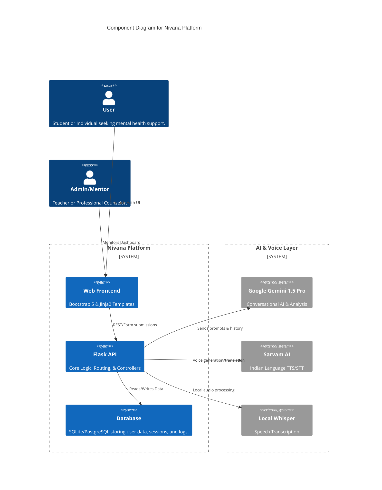
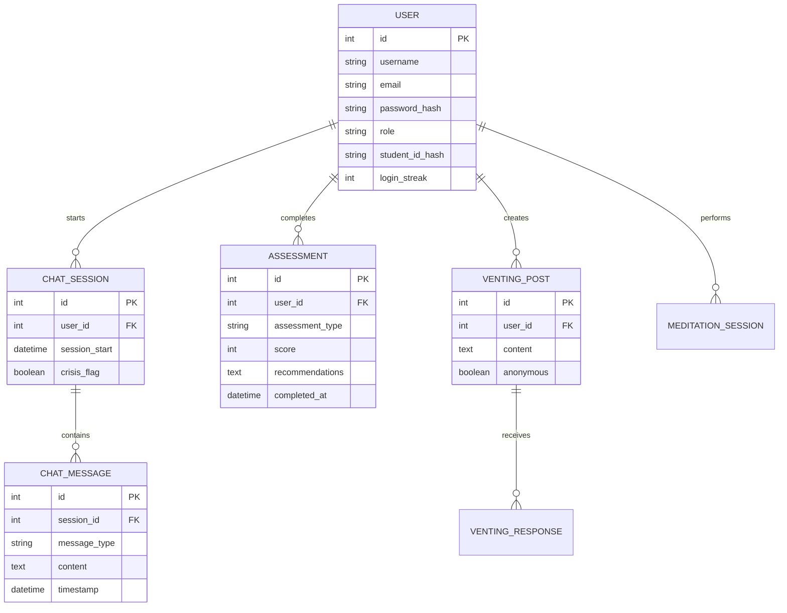

# System Architecture - Nivana Mental Health Platform

This document provides a deep dive into the technical architecture, data flow, and security design of the Nivana platform.

## 1. Component Architecture

Nivana is built using a monolithic-modular approach with a Flask backend and a Decoupled AI Processing layer.

---

## 2. Data Flow (Detailed)

### 2.1 Mental Health Assessment Flow

1. **User input**: User submits responses to a screening tool (e.g., PHQ-9).
2. **Validation**: Flask backend validates inputs and calculates a base score.
3. **AI Analysis**: The score and responses are sent to Gemini with a structured prompt.
4. **Structured JSON**: Gemini returns a JSON object containing interpretation, recommendations, and coping strategies.
5. **Persistence**: The result is saved in the `Assessment` table.
6. **Delivery**: The user is redirected to a results page with dynamic Chart.js visualizations.

### 2.2 Voice Conversion Flow

1. **Input**: User clicks "Speak" or the system generates a bot response.
2. **STT (Speech-to-Text)**: Audio captured via `streamlit-audiorecorder` or Web Speech API -> Sent to `voice_transcribe` route -> Processed by Sarvam/Whisper.
3. **TTS (Text-to-Speech)**: Bot response -> Sent to `voice_chat` route -> Sarvam AI generates a WAV file -> Served via `/audio/<filename>`.

---

## 3. Database Schema

Nivana uses a relational schema to maintain referential integrity and support complex reporting.

---

## 4. Security Implementation

### Privacy-First Design

- **ID De-identification**: Student IDs are hashed using SHA-256 before storage to ensure anonymity during research or admin review (`utils.hash_student_id`).
- **Encrypted Communication**: Support for HTTPS (via reverse proxy like Nginx).
- **Session Security**: `Flask-Login` handles session cookies with secure flags.

### Crisis Protocols

- **Keyword Monitoring**: A multi-layered keyword list (`CRISIS_KEYWORDS`) monitors all chat traffic.
- **Immediate Escalation**: When triggered, the UI injects high-priority alerts with local helpline numbers (988 in India, etc.).
- **Flagging**: Sessions are flagged in the database for specialized counselor review.
