# System Architecture - Machine-Centric Proactive Platform

This document describes the technical blueprint of Nivana, focusing on the machine-driven analytics and proactive intervention modules.

## 1. Modular Blueprint (The 4-Layer Engine)

Nivana's backend is organized into four distinct functional engines that handle everything from intake to gamification.

```mermaid
graph LR
    subgraph Engine_Layer [Core Module Engines]
        A["📝 Intake & Assessment Module"]
        B["🤖 Chatbot & AI Support Engine"]
        C["💬 Conversational History Engine"]
        D["🎮 Session Mgmt & Gamification"]
    end

    A --> |Raw Data| C
    B <--> |Context| C
    D --> |Engagement Stats| E[("📈 Analytics Data Lake")]
    C --> |Historical Trends| E
    
    E <--> F["📊 Data Processing & Analytics Layer"]
```

### 1.1 Intake & Assessment Module

- **Purpose**: Handles PHQ-9, GAD-7, and GHQ questionnaires.
- **Logic**: Performs contextual AI pre-analysis on responses before scoring to detect nuance (e.g., distinguishing between a bad day and persistent symptoms).

### 1.2 Chatbot & AI Support Engine (Intent-Aware)

- **Engine**: Fine-tuned LLM with dedicated sentiment analysis.
- **Crisis Detection**: Real-time monitoring of vocal/text inputs for clinical risk.
- **Role**: Serves as the primary touchpoint, using *Intent Recognition* to decide if a user needs a test, a vent session, or a human specialist.

### 1.3 Conversational History Engine

- **Storage**: Uses a **Vector Database** (FAISS or Pinecone) to maintain long-term context across multiple sessions.
- **Virtual Room**: Implements secure WebSockets/SQL modules to simulate a safe, persistent conversational space.

### 1.4 Session Management & Gamification

- **Engagement**: Tracks login streaks, badge completions, and assessment frequency.
- **Output**: Feeds behavioral data into the Analytics Data Lake for trend identification.

---

## 2. Data Processing & Analytics Layer

The "Machine-Centric" brain of Nivana resides here. This layer operates out-of-band to analyze the system side of the data.

- **Trend Analysis**: Uses ML models to identify worsening trends in user scores or chat sentiment.
- **Anonymized Insights**: Aggregates data for the **Therapist Dashboard**, providing high-level metrics without compromising individual identity.
- **Reporting Module**: Integrated with tools like PowerBI/Tableau or custom Talend pipelines for professional reporting.

---

## 3. Data Integration & Flows

### 3.1 Proactive Recommendation Flow

1. **Collector**: Data from History and Session modules is sent to the Data Lake.
2. **Analyzer**: The Analytics Layer runs scheduled models to check for behavioral shifts.
3. **Trigger**: If a threshold is met (e.g., three consecutive days of high-anxiety chat), a trigger is sent back to the API Gateway.
4. **Intervention**: The Chatbot is instructed to proactively suggest a "Vent Box" or "Specialist Consultation" in the next user interaction.

---

## 4. Storage Architecture

| DB Type | Functionality |
| :--- | :--- |
| **RDBMS (PostgreSQL)** | Persistent user profiles, booking schedules, and structured assessment scores. |
| **Vector DB** | Semantic storage of conversation history to enable intent awareness. |
| **Data Lake** | Raw, anonymized engagement and behavioral logs for massive trend analysis. |
