# Nivana: Proactive AI Mental Health Platform

Nivana is a next-generation, **machine-centric** mental health ecosystem. Unlike traditional reactive support systems, Nivana uses intent-aware LLMs and automated trend analysis to proactively suggest interventions, prescribe assessments, and provide personalized wellness solutions before a crisis occurs.

---

## 🌟 Key Features

- **🧠 Intent-Aware AI Support**: A fine-tuned, context-conscious chatbot that understands user sentiment and underlying needs.
- **📈 Proactive Analytics**: Machine-driven trend analysis that identifies behavioral patterns and suggests relevant tests or modules.
- **📝 Automated Intake & Assessment**: Integrated PHQ-9/GAD-7 questionnaires with contextual AI pre-analysis.
- **🌊 Module-Based Interventions**: Dynamic suggestions for tools like the **Sound Vent Box**, **Meditation**, or **Specialist Booking**.
- **📊 Therapist Analytics Dashboard**: Comprehensive data-driven insights for professionals to monitor trends and anonymized metrics.
- **🎮 Gamified Session Management**: Progress tracking with badges and streaks to ensure long-term user engagement.

---

## 🏗 Machine-Centric Architecture

Nivana's architecture is built for proactive intelligence, separating user interaction from deep data processing.

```mermaid
graph TD
    subgraph UI_Layer [User Interface]
        Mobile["📱 Mobile App (Android/iOS)"]
        Web["💻 Web Portal (React/Vue)"]
    end

    subgraph Logic_Gateway [API Gateway & Backend]
        Gateway["🚀 FastAPI / Flask Services"]
    end

    subgraph Module_Layer [Intake & Support Modules]
        Intake["📝 Intake & Assessment Module<br/>(Pre-Analysis)"]
        ChatEngine["🤖 Chatbot & AI Support<br/>(LLM / Crisis Detect)"]
        History["💬 Conversational History<br/>(Context Engine)"]
        Session["🎮 Session Mgmt & Gamification<br/>(Tracking)"]
    end

    subgraph Analytics_Layer [Data Processing & Analytics]
        TrendAnal["📊 Trend Analysis & Insights<br/>(ML/Reporting)"]
    end

    subgraph Storage_Layer [Storage & Persistence]
        VectorDB[("🧠 Vector DB<br/>(History Context)")]
        RDBMS[("🗄 User & Booking DB")]
        DataLake[("📈 Analytics Data Lake")]
    end

    subgraph External_Integrations [External Integrations]
        Notif["📧 SMS/Email Notifications"]
        Monitor["📡 System Monitoring"]
    end

    %% Flow
    UI_Layer <--> Gateway
    Gateway <--> Intake & ChatEngine & History & Session
    
    Intake --> RDBMS
    ChatEngine <--> VectorDB
    History --> RDBMS
    Session --> DataLake
    
    TrendAnal <--> DataLake & RDBMS
    
    TrendAnal --> Gateway
    Gateway --> Notif & Monitor
```

---

## 🔄 Proactive User Workflow

The system doesn't just wait for input; it proactively guides the user journey.

---

## 🛠 Tech Stack

| Component | Technology |
| :--- | :--- |
| **Backend** | Python, Flask/FastAPI, SQLAlchemy |
| **User Interface** | Bootstrap 5, Jinja2, Chart.js, React/Vue (Frontend ready) |
| **Intelligence** | Gemini 1.5 Pro (Fine-tuned), LangChain, VectorDB (FAISS/Pinecone) |
| **Analytics** | Scikit-Learn, Pandas, PowerBI/Talend Integration |
| **Voice/Audio** | Sarvam AI, OpenAI Whisper |
| **Data Lake** | Snowflake/PostgreSQL Analytics Schema |

---

## 🚀 Installation & Setup

Please refer to the original `README.md` structure for detailed installation steps or check [ARCHITECTURE.md](file:///c:/Users/Sarang/OneDrive/Desktop/techfiesta_mentalhealth/ARCHITECTURE.md) for deeper system specs.

---

**Nivana** - *Peace of mind, proactively driven.*
