# Nivana: AI-Powered Mental Health Platform


Nivana is a comprehensive, privacy-first mental health support ecosystem designed to provide students and individuals with immediate, empathetic, and evidence-based psychological assistance. By leveraging cutting-edge Generative AI and localized voice services, Nivana bridges the gap between those in need and professional mental health care.

---

## 🌟 Key Features

- **🤖 Compassionate AI Chatbot**: Real-time emotional support powered by Gemini 1.5 Pro with specialized crisis detection and active listening protocols.
- **📝 Standardized Assessments**: Scientifically validated screening tools including PHQ-9 (Depression), GAD-7 (Anxiety), and GHQ (General Health).
- **🎤 Multilingual Voice Integration**: Hands-free interaction using Sarvam AI for high-quality Indian language TTS and STT.
- **🌊 Anonymous Venting Hall**: A safe space for emotional release through text and sound (decibel-monitored scream therapy).
- **🧘 Guided Meditation & Wellness**: Curated meditation sessions and progress tracking via gamified login streaks.
- **🏢 Professional Consultation**: Integrated booking system for connecting users with licensed counselors and mentors.
- **🚨 Crisis Intervention**: Automated detection of self-harm indicators with immediate escalation to emergency resources.

---

## 🏗 System Architecture

Nivana follows a modular multi-tier architecture designed for scalability and high availability.

```mermaid
graph TD
    subgraph Client_Layer [Client Layer]
        Web["💻 Web App (Bootstrap/JS)"]
        Mobile["📱 Mobile App (Android/iOS)"]
    end

    subgraph API_Layer [API & Logic Layer]
        FlaskServer["🚀 Flask Backend"]
        Auth["🔐 Flask-Login Auth"]
        Routes["🛣 Service Routes"]
    end

    subgraph AI_Processing_Layer [AI & Intelligence Layer]
        Gemini["🤖 Gemini 1.5 Pro (LLM)"]
        Sarvam["🎤 Sarvam AI (Voice)"]
        Whisper["👂 Whisper STT"]
        CrisisDetect["🚨 Crisis Detection Logic"]
    end

    subgraph Data_Layer [Data Layer]
        DB[("🗄 SQLite/PostgreSQL")]
        Models["📊 User/Chat/Assessment Models"]
    end

    subgraph External_Services [External Integrations]
        Email["📧 SMTP Email Service"]
        Twilio["📞 Twilio/SMS API"]
    end

    %% Connections
    Web & Mobile --> FlaskServer
    FlaskServer --> Auth
    FlaskServer --> Routes
    Routes --> Gemini & Sarvam & Whisper & CrisisDetect
    Routes --> Models
    Models --> DB
    Routes --> Email & Twilio
```



---

## 🔄 User Workflow

The following diagram illustrates the typical user journey through the Nivana ecosystem.


---

## 🛠 Tech Stack

| Component | Technology |
| :--- | :--- |
| **Backend** | Python, Flask, SQLAlchemy |
| **Frontend** | Bootstrap 5, Jinja2, Chart.js, Vanilla JS |
| **Database** | SQLite (Dev), PostgreSQL (Prod) |
| **AI LLM** | Google Gemini 1.5 Pro, LangChain |
| **Voice/Audio** | Sarvam AI, OpenAI Whisper, Coqui TTS, pyttsx3 |
| **Communication** | SMTP (Email), ReportLab (PDF Generation) |
| **Environment** | Python Dotenv, Virtualenv |

---

## 🚀 Installation & Setup

### 1. Prerequisites

- Python 3.10 or higher
- NVIDIA GPU (Optional, for local AI acceleration)
- API Keys: `GEMINI_API_KEY`, `SARVAM_API_KEY` (if using voice services)

### 2. Clone the Repository

```bash
git clone https://github.com/SarangRao20/techfiesta_mentalhealth.git
cd techfiesta_mentalhealth
```

### 3. Setup Virtual Environment

```bash
python -m venv venv
# On Windows
.\venv\Scripts\activate
# On Linux/macOS
source venv/bin/activate
```

### 4. Install Dependencies

Choose the appropriate requirement file based on your hardware:

- **CPU Only**:

  ```bash
  pip install -r requirements.txt --extra-index-url https://download.pytorch.org/whl/cpu
  ```

- **GPU (CUDA 11.8)**:

  ```bash
  pip install -r requirements.txt --extra-index-url https://download.pytorch.org/whl/cu118
  ```

### 5. Environment Configuration

Create a `.env` file in the root directory:

```env
FLASK_APP=app.py
FLASK_ENV=development
SECRET_KEY=your_secret_key
DATABASE_URL=sqlite:///nivana.db
GEMINI_API_KEY=your_gemini_key
# Optional Voice Services
SARVAM_API_KEY=your_sarvam_key
```

### 6. Initialize Database & Run

```bash
python migrate_db.py
python main.py
```

---

## 🔮 Future Roadmap

- [ ] **VR Integration**: Immersive exposure therapy and relaxation environments.
- [ ] **Wearable Sync**: Real-time heart rate and stress monitoring using IoT devices.
- [ ] **Advanced Biofeedback**: Analyzing vocal tremors and speech patterns for deeper emotional insight.
- [ ] **Localized Counselor Network**: Geographical matching for in-person support.
- [ ] **Peer Support Groups**: Moderated community spaces for shared experiences.

---

## 🛡 Security & Privacy

Nivana prioritizes user anonymity and data integrity:

- **Hashed Student IDs**: Ensuring user identities are protected even from internal leaks.
- **Secure Hashing (Werkzeug)**: Industry-standard password encryption.
- **Session Management**: Secure, timeout-aware sessions for dashboard access.
- **Crisis Protocols**: Non-intrusive monitoring that only escalates when safety is at risk.

---

## 📄 License

This project is licensed under the MIT License - see the [LICENSE](LICENSE) file for details.

---

**Nivana** - *Peace of mind, one conversation at a time.*
